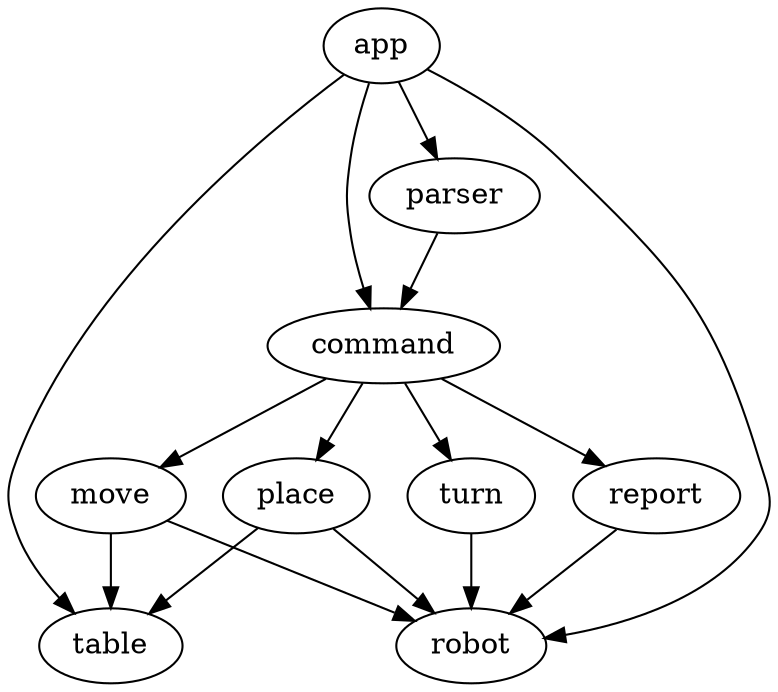
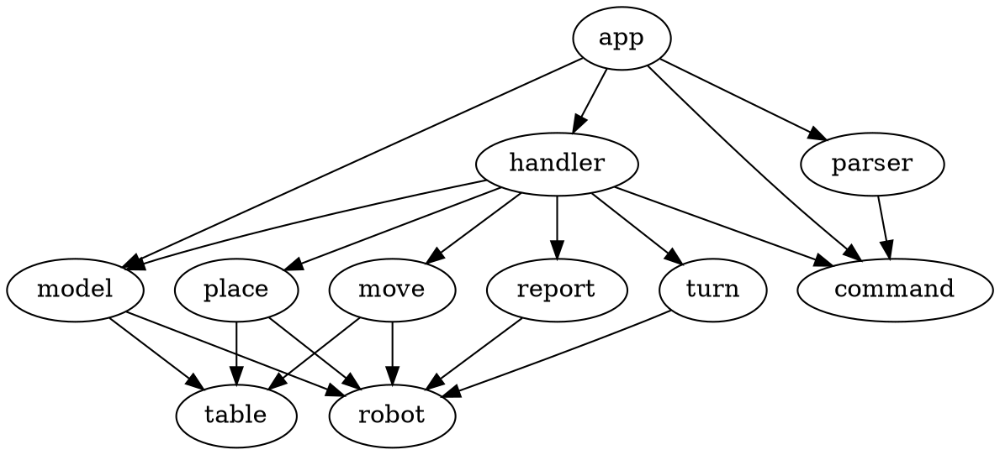

# toy robot in go

## First design

app sends input to parser which gives back commands; app then executes those commands on its own state

## Second design
 
app sends input to parser which gives back commands. app has state stored in model. App passes model and commands to handler which executes the command on the model, updating the model's state.

