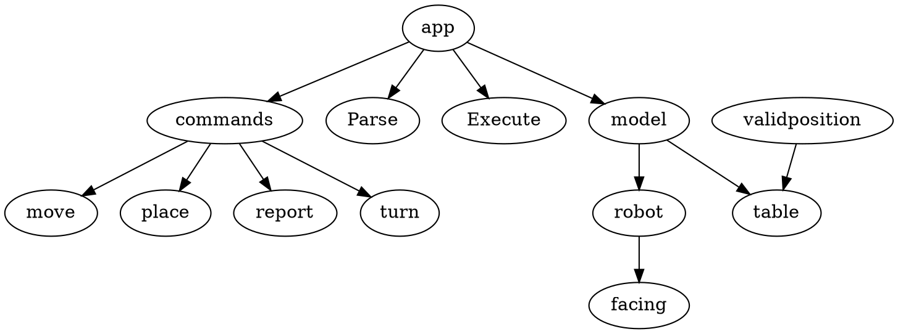

# toy robot in go

## First design

app sends input to parser which gives back commands; app then executes those commands on its own model

## Second design
 
app sends input to parser which gives back commands. app has model stored in state. App passes state and commands to handler which executes the command on the state, updating the state's model.

## Third design: fewest abstractions

Integration tests would be easy with this design, just feed input lines to Handle and then check model.

## Fourth design: command pattern

How to decide which command to call? Pull out first word of command and select? Give line to each command until one can parse it? Yeah, that's better (but possibly less performant).

Update go to 1.12.5 using `snap install go --classic`.

Try again with packages.

Now that I've finished coding, redraw architectural diagram.

